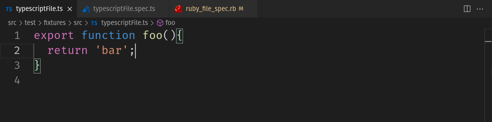

# spec-utils
This extension adds a set of commands to aid the work with test files.

# Suport
### Javascript / Typescript files:
Jest, Cypress and mocha identifiers, .ts, .js, .tsx, .jsx file extensions.

### Ruby:
RSpec identifies, .rb file extension.

# Commands

### switchSpec
Switch between the source and test file.

### copySpecPath
Copy to the clipboard the relative path of the test file, works from both source and test file.

### toggleFixedSpec
Toggle the closest test block to 'fixed' or 'only' state acording to the current test framework.

